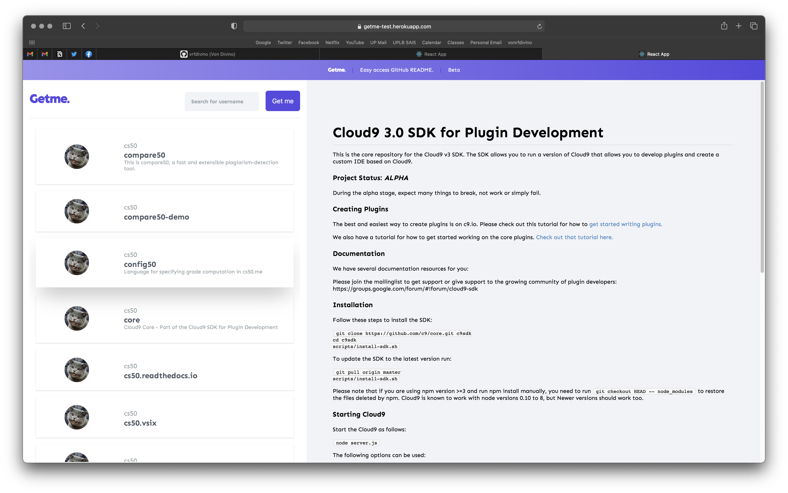

# [Getme](http://getme-test.herokuapp.com)

___

###### A web application to search GitHub projects. Vist [http://getme-test.herokuapp.com](http://getme-test.herokuapp.com)!

## How it works?

___

1. The user will enter a GitHub username.
2. Upon searching, the web app will search all the repos created by the GitHub user.
3. You can view the README of a repo when available.

## Architecture

___

1. React was used to develop user interfaces and the frontend.
2. SCSS was used to develop the stylesheets of every UI and converge into one.
3. GitHUB RESTful API via Octokit was used to fetch GitHub-related data.
4. Extensions such as `@varandas/fetch-readme`, `react-markdown`, and `react-spinner` were used to develope other interfaces.
5. TypeScript was used as an extension with JS to minimize production bugs.
6. Heroku was used to deploy the production app.

## Run on your local machine

___

1. Clone this project by typing `git clone https://github.com/vrfdivino/getme.git`.
2. Make sure you have `node` and `npm` installed in your machine.
3. Install dependencies by typing `npm install`.
4. Create a `.env.local` file. Put a `REACT_APP_GITHUB_ACCESS_TOKEN` variable. You can generate a token by visiting this [link](https://docs.github.com/en/authentication/keeping-your…).
5. Once you completed the steps above, run the app by typing `npm start`.

## About the creator

___

Hi! I am [Von Divino](https://github.com/vrfdivino), a software developer based in the Philippines focusing on Human-Computer Interaction and Computer Architecture.